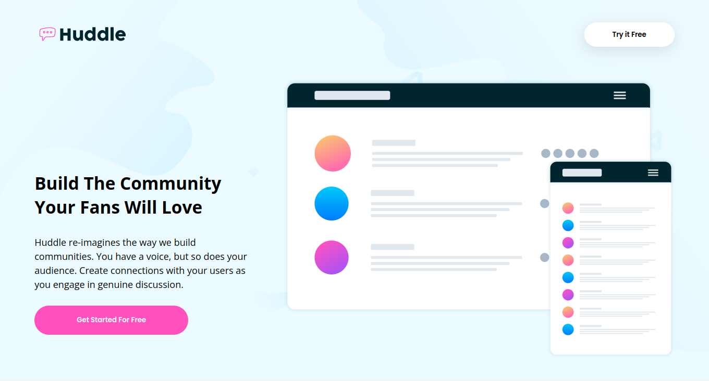
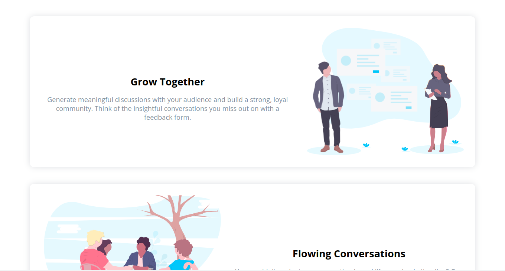
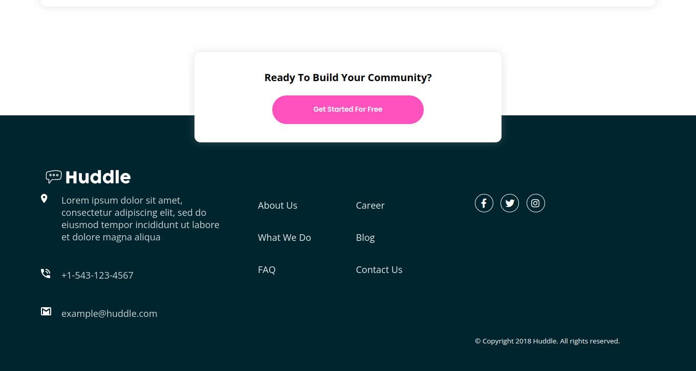

# Frontend Mentor - Huddle landing page with alternating feature blocks solution

This is a solution to the [Huddle landing page with alternating feature blocks challenge on Frontend Mentor](https://www.frontendmentor.io/challenges/huddle-landing-page-with-alternating-feature-blocks-5ca5f5981e82137ec91a5100). Frontend Mentor challenges help you improve your coding skills by building realistic projects. 

## Table of contents

- [Overview](#overview)
  - [The challenge](#the-challenge)
  - [Screenshot](#screenshot)
  - [Links](#links)
- [My process](#my-process)
  - [Built with](#built-with)
  
- [Author](#author)

## Overview

### The challenge

Users should be able to:

- View the optimal layout for the site depending on their device's screen size
- See hover states for all interactive elements on the page

### Screenshot

### Links

- Solution URL: [Add solution URL here](https://your-solution-url.com)
- Live Site URL: [Add live site URL here](https://your-live-site-url.com)

## My process

- Analysed the required layout to determine how I need to structure my HTML.
- Created the HTML, optimally using divs and section to simplify the CSS file.
- Finally, in style.css:
	- First setup the root variables
	- Applied the CSS reset
	- Built the layout(Positioning and sizing the divs)
	- Added colors and fonts.
	- Finished by applying hover effects.

### Built with

- Semantic HTML5 markup
- CSS custom 
- Flexbox
- CSS Grid
- Mobile-first workflow

## Author

- Frontend Mentor - [PriyanshuSahani](https://www.frontendmentor.io/profile/PriyanshuSahani)
